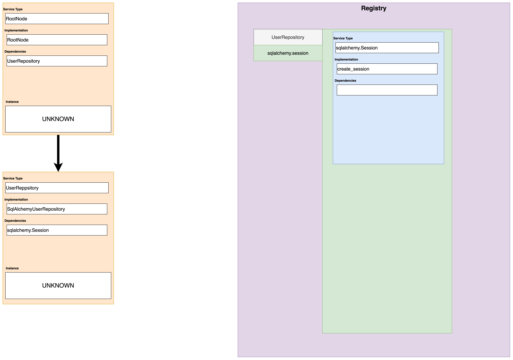
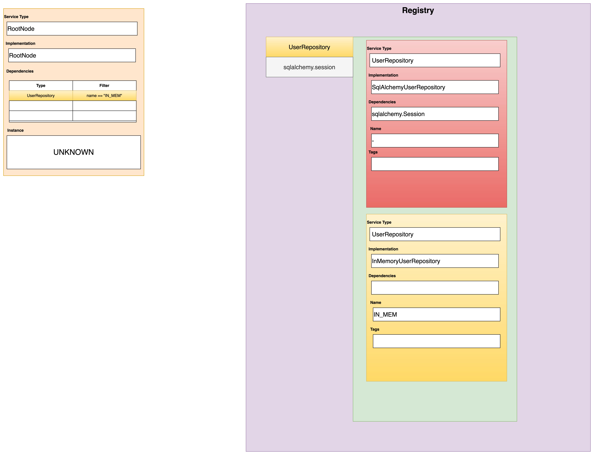

# Filtering
Filtering allows you to be more selective on how the container will select the desired dependencies that you want.
For instances if I have two registrations of the same class with slight differences it allows you to select which if those registered dependencies that you want.

To get a good mental picture on how filtering works it's best to get a grasp on how registering a nd resolving works in Clean IoC.

## How registering and resolving works in clean_ioc

The steps below are just an simplified model on how registering and resolving works in Clean IoC. Decorators, Pre-Configurations and Scopes have been omitted for simplicity.
Clean Ioc is just based on two simple concepts.

When you register a dependency it get's stored in a registry.
When you want to resolve an object from the container you create you build a dependency graph and query the registry recursively for the next dependency in the graph.


### 1. Registering the InMemoryRepository

<div class="grid" markdown>
<div markdown>
A `UserRepository` is registered with an `InMemoryUserRepository`
This creates a **registration** in the **registry** mapping `UserRepository` to `InMemoryUserRepository`

```python
container = Container()
container.register(UserRepository, InMemoryUserRepository)
```
</div>


</div>

### 2. Registering the SqlAlchemyUserRepository

<div class="grid" markdown>
<div markdown>
Now a `SqlAlchemyUserRepository` is registered for a `UserRepository`. The registry orders it's registrations by LIFO so when we resolve a `UserRepository` we get a `SqlAlchemyUserRepository`

```python
container = Container()
container.register(UserRepository, InMemoryUserRepository)
container.register(UserRepository, SqlAlchemyUserRepository)
```
</div>


</div>

### 3. Registering the sqlalchemy Session with a factory

<div class="grid" markdown>
<div markdown>
We now create a factory to create a `sqlalchemy.Session`, this gets placed in the registry user `sqlalchemy.Session`.

```python
def create_session():
    ## This does not the correct way to create a session, just here for demo purposes
    return sqlalchemy.Session()

container = Container()
container.register(UserRepository, InMemoryUserRepository)
container.register(UserRepository, SqlAlchemyUserRepository)
container.register(sqlalchemy.Session, factory=create_session)
```
</div>


</div>

### 4. Resolving the UserRepository and creating a Dependency Graph

<div class="grid" markdown>
<div markdown>
When we try to resolve UserRepository we create a **dependency graph**, the graph initially contains one root node with a dependency `UserRepository`. The graph now tries to resolve it's dependencies by checking the **registry** for any matching **registrations**.

```python
def create_session():
    ## This does not the correct way to create a session, just here for demo purposes
    return sqlalchemy.Session()


container = Container()
container.register(UserRepository, InMemoryUserRepository)
container.register(UserRepository, SqlAlchemyUserRepository)
container.register(sqlalchemy.Session, factory=create_session)

user_repo = container.resolve(UserRepository)
```
</div>


</div>

### 5. Find our registration for UserRepository

<div class="grid" markdown>
<div markdown>
The **registry** finds a `SqlAlchemyUserRepository` for `UserRepository`

```python
def create_session():
    ## This does not the correct way to create a session, just here for demo purposes
    return sqlalchemy.Session()

container = Container()
container.register(UserRepository, InMemoryUserRepository)
container.register(UserRepository, SqlAlchemyUserRepository)
container.register(sqlalchemy.Session, factory=create_session)

user_repo = container.resolve(UserRepository)
```
</div>


</div>

### 6. Creates the next Node in the Graph

<div class="grid" markdown>
<div markdown>
Next a new node is created in the graph for `SqlAlchemyUserRepository`

```python
def create_session():
    ## This does not the correct way to create a session, just here for demo purposes
    return sqlalchemy.Session()

container = Container()
container.register(UserRepository, InMemoryUserRepository)
container.register(UserRepository, SqlAlchemyUserRepository)
container.register(sqlalchemy.Session, factory=create_session)

user_repo = container.resolve(UserRepository)
```
</div>


</div>

### 7. Find the next dependency

<div class="grid" markdown>
<div markdown>
Next the graph wants to find the `sqlalchemy.Session` and queries the **registry** for it.

```python
def create_session():
    ## This does not the correct way to create a session, just here for demo purposes
    return sqlalchemy.Session()

container = Container()
container.register(UserRepository, InMemoryUserRepository)
container.register(UserRepository, SqlAlchemyUserRepository)
container.register(sqlalchemy.Session, factory=create_session)

user_repo = container.resolve(UserRepository)
```
</div>


</div>

### 8. Turn the dependency graph to build your object

<div class="grid" markdown>
<div markdown>
Once all dependencies are solved for the graph, the graph traverses upwards to create the object with the solved dependencies

```python
def create_session():
    ## This does not the correct way to create a session, just here for demo purposes
    return sqlalchemy.Session()

container = Container()
container.register(UserRepository, InMemoryUserRepository)
container.register(UserRepository, SqlAlchemyUserRepository)
container.register(sqlalchemy.Session, factory=create_session)

user_repo = container.resolve(UserRepository)
```
</div>


</div>


## Filtering registrations

### Registrations

When a new dependency is registered to the container it's stored in the registry as a **Registration**.
Here is the definition of the registration:

::: clean_ioc.core.Registration
    options:
      heading_level: 3
      parameter_headings: false
      show_root_heading: false
      inherited_members: false
      members: false
      show_bases: false

#### Registration Name

When defining registrations you can add a name to the registration.

```python
container = Container()
container.register(int, instance=1, name="One")
container.register(int, instance=2, name="Two")
container.register(int, instance=3, name="Three")
```


#### Registration Tags

Registration tags can be either set as keys or key/value pairs

Tags as keys

```python
container = Container()
container.register(int, instance=1, tags=[Tag("odd")])
container.register(int, instance=2, tags=[Tag("even")])
container.register(int, instance=3, tags=[Tag("odd")])
```

Tags as key value/value pairs

```python
container = Container()
container.register(int, instance=1, tags=[Tag("parity", "odd")])
container.register(int, instance=2, tags=[Tag("parity", "even")])
container.register(int, instance=3, tags=[Tag("parity", "odd")])
```

#### Registration Filters

Registration filters are defined a **Callable** that receives a registration and returns a boolean.

For example here is a filter for only returning registrations that are Singletons

```python
def only_singletons(registration: Registration) -> bool:
    return registration.lifespan == Lifespan.singleton
```

#### Using Registration Filters
Here is an example of using registration filters

```python
container = Container()
container.register(int, instance=1, name="One", tags=[Tag("odd")])
container.register(int, instance=2, name="Two", tags=[Tag("even")])
container.register(int, instance=3, name="Three", tags=[Tag("odd")])


container.resolve(int, filter=lambda r: r.name == "Two") # returns 2
container.resolve(int, filter=lambda r: r.has_tag("odd")) # returns 3
container.resolve(int, filter=lambda r: r.name == "One") # returns 1
```

Clean Ioc comes with builtin registration filters for convenience.

Here is the same code above as but using the inbuilt filters
```python
import clean_ioc.registration_filters as rf

container = Container()
container.register(int, instance=1, name="One", tags=[Tag("odd")])
container.register(int, instance=2, name="Two", tags=[Tag("even")])
container.register(int, instance=3, name="Three", tags=[Tag("odd")])


container.resolve(int, filter=rf.with_name("Two")) # returns 2
container.resolve(int, filter=rf.has_tag("odd")) # returns 3
container.resolve(int, filter=rf.with_name("One")) # returns 1
```


!!! info "Named registration filtering"
    The default filtering behavior of resolving is to look for unnamed registrations
    if you name a registration you have to explicitly filter for it.

    ```python
    container = Container()
    container.register(int, instance=1)
    container.register(int, instance=2, name="Two")

    container.resolve(int) # returns 1
    container.resolve(int, filter=rf.with_name("Two")) # returns 2
    ```


## Resolving with a named filter


### 1. Registering the InMemoryRepository

<div class="grid" markdown>
<div markdown>
Same as the previous example we now but we now register our **InMemoryUserRepository** with a name

```python
container = Container()

def create_session():
    # DO DB STUFF
    pass

container.register(sqlalchemy.Session, factory=create_session)

container.register(UserRepository, SqlAlchemyUserRepository)
container.register(UserRepository, InMemoryUserRepository name="IN_MEM")
```

</div>

</div>


### 2. Resolving and filtering by name

<div class="grid" markdown>
<div markdown>
We resolve but this time filter for the name=="IN_MEM"
```python
container = Container()

def create_session():
    # DO DB STUFF
    pass

container.register(sqlalchemy.Session, factory=create_session)

container.register(UserRepository, SqlAlchemyUserRepository)
container.register(UserRepository, InMemoryUserRepository name="IN_MEM")

repo = container.resolve(UserRepository, filter=rf.with_name("IN_MEM"))
```

</div>

</div>


### 3. Returns an InMemoryUserRepository

<div class="grid" markdown>
<div markdown>
An instance of **InMemoryUserRepository** is returned
```python
container = Container()

def create_session():
    # DO DB STUFF
    pass

container.register(sqlalchemy.Session, factory=create_session)

container.register(UserRepository, SqlAlchemyUserRepository)
container.register(UserRepository, InMemoryUserRepository name="IN_MEM")

repo = container.resolve(UserRepository, filter=rf.with_name("IN_MEM"))
```

</div>

</div>


## Applying registration filters deeper in the graph.
The previous example showed us how to filter a registration in the resolve method, but we will often need to filter a registration based on a dependency that is deeper in the dependency graph.
This is where top down filtering and bottom up filtering comes in to play.

### Top down filtering
Top down filtering is the filtering method of registrations defining filtering for their children. This is achieved by defining **dependency config** on our **Registration**


### Dependency Config & Dependency Settings
Dependency settings allow you to define what child dependencies to filter for.

Here is the definition of dependency config in Clean Ioc.

::: clean_ioc.core.DependencySettings
    options:
      heading_level: 3
      parameter_headings: false
      show_root_heading: false
      inherited_members: false
      members: false
      show_bases: false


Dependency config is a dict of string to **DependencySettings** where the key is the parameter name in the `__init__` function or function in the case of a factory.
```python
class Greeter:
    def __init__(self, message: str):
        self.message = message

    def get_message(self, name: str):
        return f"{self.message} {name}"

container = Container()

container.register(str, instance="Hello", name="Hi")
container.register(str, instance="Goodbye", name="Bye")

container.register(
    Greeter,
    name="SaysHello",
    dependency_config={"message": DependencySettings(filter=with_name("Hi"))}
)


container.register(
    Greeter,
    name="SaysGoodbye",
    dependency_config={"message": DependencySettings(filter=with_name("Bye"))}
)

greeter_1 = container.resolve(Client, filter=with_name("SaysHello"))
greeter_2 = container.resolve(Client, filter=with_name("SaysGoodbye"))

greeter_1.get_message("Joe") # Hello Joe
greeter_2.get_message("Joe") # Goodbye Joe
```

### Bottom Up Filtering

Bottom up filtering is the method of allowing child dependencies filter out parents based on the state of the dependency graph

#### Parent Node Filters

Parent node filters are a callable take a Node as a parameter and return a boolean.

::: clean_ioc.core.Node
    options:
      heading_level: 3
      parameter_headings: false
      show_root_heading: false
      inherited_members: false
      members: false
      show_bases: false


```python
import clean_ioc.node_filters as nf

class A:
    pass

class B(A):
    pass

class C(A):
    pass

class D:
    def __init__(self, a: A):
        self.a = a

class E:
    def __init__(self, a: A):
        self.a = a

container = Container()

container.register(A, B, parent_node_filter=nf.implementation_type_is(E))
container.register(A, C, parent_node_filter=nf.implementation_type_is(D))
container.register(D)
container.register(E)

e = container.resolve(E)
d = container.resolve(D)

type(e.a) # returns type of B
type(d.a) # returns type of C

```


## An example of top down filtering combined with bottom up filtering

Were now going to use a more complex example of our repositories pattern.
We are going to add a product repository type and also set it up that the user repository and product repository point to two different databases.

### 1. Registering our dependencies

<div class="grid" markdown>
<div markdown>
Registering the repositories and their respective database config.
The repositories filter the session top down and the database config filter the session bottom up.
```python

@dataclass
class DbConnectionConfig:
    hostname: str
    database_name: str
    username: str
    password: str

container = Container()

def create_session(config: DbConnectionConfig):
    # DO DB STUFF
    pass

user_db_settings = DbConnectionConfig(
    hostname="db_server",
    database_name="users",
    username="SecureName",
    database_name="NotVerySecurePassword",
)

product_db_settings = DbConnectionConfig(
    hostname="db_server",
    database_name="products",
    username="SecureName",
    database_name="NotVerySecurePassword",
)


container.register(sqlalchemy.Session, factory=create_session, tags=Tag("Database", "UserDb"))
container.register(sqlalchemy.Session, factory=create_session, tags=Tag("Database", "ProductDb"))

container.register(UserRepository, SqlAlchemyUserRepository, dependency_config: {"session": DependencySettings(filter=rf.has_tag("Database", "UserDb"))})
container.register(UserRepository, InMemoryUserRepository name="IN_MEM")
container.register(ProductRepository, SqlAlchemyProductRepository, dependency_config: {"session": DependencySettings(filter=rf.has_tag("Database", "ProductDb"))})


container.register(DbConnectionConfig, instance=user_db_settings, parent_node_filter=nf.has_registration_tag("Database", "UserDb"))
container.register(DbConnectionConfig, instance=product_db_settings, parent_node_filter=rf.has_registration_tag("Database", "ProductDb"))

```

</div>

</div>


### 2. Resolving the UserRepository

<div class="grid" markdown>
<div markdown>
InMemoryUserRepository is skipped because it is named

```python

@dataclass
class DbConnectionConfig:
    hostname: str
    database_name: str
    username: str
    password: str

container = Container()

def create_session(config: DbConnectionConfig):
    # DO DB STUFF
    pass

user_db_settings = DbConnectionConfig(
    hostname="db_server",
    database_name="users",
    username="SecureName",
    database_name="NotVerySecurePassword",
)

product_db_settings = DbConnectionConfig(
    hostname="db_server",
    database_name="products",
    username="SecureName",
    database_name="NotVerySecurePassword",
)


container.register(sqlalchemy.Session, factory=create_session, tags=Tag("Database", "UserDb"))
container.register(sqlalchemy.Session, factory=create_session, tags=Tag("Database", "ProductDb"))

container.register(UserRepository, SqlAlchemyUserRepository, dependency_config: {"session": DependencySettings(filter=rf.has_tag("Database", "UserDb"))})
container.register(UserRepository, InMemoryUserRepository name="IN_MEM")
container.register(ProductRepository, SqlAlchemyProductRepository, dependency_config: {"session": DependencySettings(filter=rf.has_tag("Database", "ProductDb"))})


container.register(DbConnectionConfig, instance=user_db_settings, parent_node_filter=nf.has_registration_tag("Database", "UserDb"))
container.register(DbConnectionConfig, instance=product_db_settings, parent_node_filter=rf.has_registration_tag("Database", "ProductDb"))


user_repo = container.resolve(UserRepository)
```

</div>

</div>


### 3. Finding the session

<div class="grid" markdown>
<div markdown>
The correct db session is found because we look for a tag matching `"Database"=="UserDb"`

```python

@dataclass
class DbConnectionConfig:
    hostname: str
    database_name: str
    username: str
    password: str

container = Container()

def create_session(config: DbConnectionConfig):
    # DO DB STUFF
    pass

user_db_settings = DbConnectionConfig(
    hostname="db_server",
    database_name="users",
    username="SecureName",
    database_name="NotVerySecurePassword",
)

product_db_settings = DbConnectionConfig(
    hostname="db_server",
    database_name="products",
    username="SecureName",
    database_name="NotVerySecurePassword",
)


container.register(sqlalchemy.Session, factory=create_session, tags=Tag("Database", "UserDb"))
container.register(sqlalchemy.Session, factory=create_session, tags=Tag("Database", "ProductDb"))

container.register(UserRepository, SqlAlchemyUserRepository, dependency_config: {"session": DependencySettings(filter=rf.has_tag("Database", "UserDb"))})
container.register(UserRepository, InMemoryUserRepository name="IN_MEM")
container.register(ProductRepository, SqlAlchemyProductRepository, dependency_config: {"session": DependencySettings(filter=rf.has_tag("Database", "ProductDb"))})


container.register(DbConnectionConfig, instance=user_db_settings, parent_node_filter=nf.has_registration_tag("Database", "UserDb"))
container.register(DbConnectionConfig, instance=product_db_settings, parent_node_filter=rf.has_registration_tag("Database", "ProductDb"))


user_repo = container.resolve(UserRepository)
```

</div>

</div>


### 4. Finding the config

<div class="grid" markdown>
<div markdown>
We find the correct config because we looking for a parent with tag `"Database"=="UserDb"`

```python

@dataclass
class DbConnectionConfig:
    hostname: str
    database_name: str
    username: str
    password: str

container = Container()

def create_session(config: DbConnectionConfig):
    # DO DB STUFF
    pass

user_db_settings = DbConnectionConfig(
    hostname="db_server",
    database_name="users",
    username="SecureName",
    database_name="NotVerySecurePassword",
)

product_db_settings = DbConnectionConfig(
    hostname="db_server",
    database_name="products",
    username="SecureName",
    database_name="NotVerySecurePassword",
)


container.register(sqlalchemy.Session, factory=create_session, tags=Tag("Database", "UserDb"))
container.register(sqlalchemy.Session, factory=create_session, tags=Tag("Database", "ProductDb"))

container.register(UserRepository, SqlAlchemyUserRepository, dependency_config: {"session": DependencySettings(filter=rf.has_tag("Database", "UserDb"))})
container.register(UserRepository, InMemoryUserRepository name="IN_MEM")
container.register(ProductRepository, SqlAlchemyProductRepository, dependency_config: {"session": DependencySettings(filter=rf.has_tag("Database", "ProductDb"))})


container.register(DbConnectionConfig, instance=user_db_settings, parent_node_filter=nf.has_registration_tag("Database", "UserDb"))
container.register(DbConnectionConfig, instance=product_db_settings, parent_node_filter=rf.has_registration_tag("Database", "ProductDb"))


user_repo = container.resolve(UserRepository)
```

</div>

</div>


### 5. Building the object

<div class="grid" markdown>
<div markdown>
Finally we build and return user repository with the correct database session.

```python

@dataclass
class DbConnectionConfig:
    hostname: str
    database_name: str
    username: str
    password: str

container = Container()

def create_session(config: DbConnectionConfig):
    # DO DB STUFF
    pass

user_db_settings = DbConnectionConfig(
    hostname="db_server",
    database_name="users",
    username="SecureName",
    database_name="NotVerySecurePassword",
)

product_db_settings = DbConnectionConfig(
    hostname="db_server",
    database_name="products",
    username="SecureName",
    database_name="NotVerySecurePassword",
)


container.register(sqlalchemy.Session, factory=create_session, tags=Tag("Database", "UserDb"))
container.register(sqlalchemy.Session, factory=create_session, tags=Tag("Database", "ProductDb"))

container.register(UserRepository, SqlAlchemyUserRepository, dependency_config: {"session": DependencySettings(filter=rf.has_tag("Database", "UserDb"))})
container.register(UserRepository, InMemoryUserRepository name="IN_MEM")
container.register(ProductRepository, SqlAlchemyProductRepository, dependency_config: {"session": DependencySettings(filter=rf.has_tag("Database", "ProductDb"))})


container.register(DbConnectionConfig, instance=user_db_settings, parent_node_filter=nf.has_registration_tag("Database", "UserDb"))
container.register(DbConnectionConfig, instance=product_db_settings, parent_node_filter=rf.has_registration_tag("Database", "ProductDb"))


user_repo = container.resolve(UserRepository)
```

</div>

</div>

