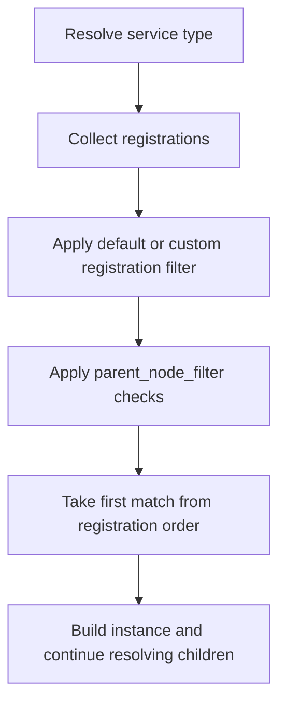
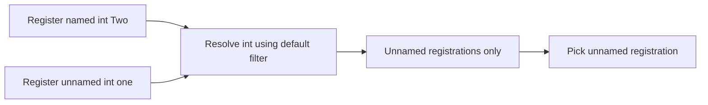
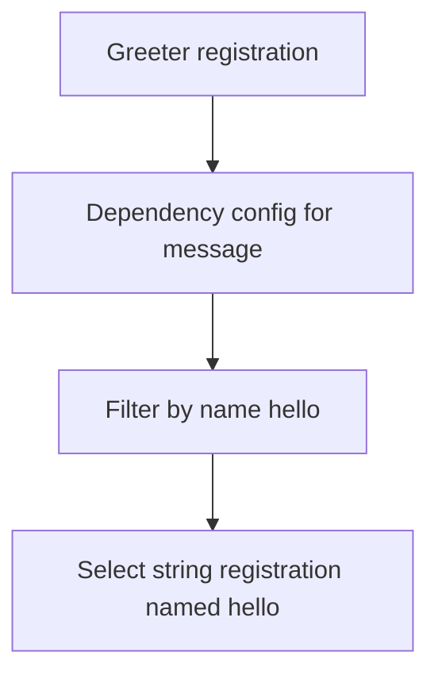
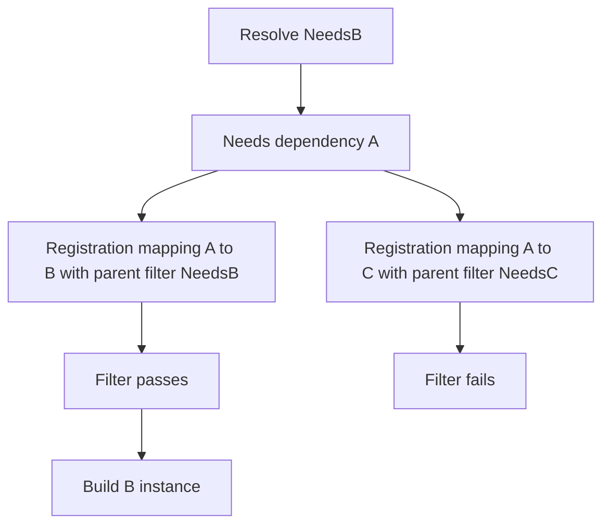

# Filtering

Filtering controls which registration is selected when multiple registrations match a service type.

```python
from clean_ioc import Container, DependencySettings, Tag
from clean_ioc.registration_filters import has_tag, with_name
import clean_ioc.node_filters as nf
```

## Visual model

Filtering happens during registration selection inside resolution.
At a high level:


```mermaid
flowchart TD
    A[Resolve service type] --> B[Collect registrations]
    B --> C[Apply default or custom registration filter]
    C --> D[Apply parent_node_filter checks]
    D --> E[Take first match from registration order]
    E --> F[Build instance and continue resolving children]
```

## Default behavior

By default, `resolve(...)` uses unnamed registrations only.

```python
container = Container()
container.register(int, instance=1)
container.register(int, instance=2, name="Two")

print(container.resolve(int))                      # 1
print(container.resolve(int, filter=with_name("Two")))  # 2
```

Selection order is LIFO (last registration checked first):


```mermaid
flowchart LR
    R3[Register named int Two] --> Q
    R2[Register unnamed int one] --> Q
    Q[Resolve int using default filter] --> U[Unnamed registrations only]
    U --> Pick[Pick unnamed registration]
```

## Name and tag filters

```python
container = Container()
container.register(str, instance="prod", tags=[Tag("env", "prod")])
container.register(str, instance="dev", tags=[Tag("env", "dev")])

value = container.resolve(str, filter=has_tag("env", "dev"))
print(value)  # dev
```

## Top-down filtering with `dependency_config`

Top-down means the parent registration constrains which child registration is allowed for a given argument.


```mermaid
flowchart TD
    G[Greeter registration] --> M[Dependency config for message]
    M --> F1[Filter by name hello]
    F1 --> S1[Select string registration named hello]
```

```python
class Greeter:
    def __init__(self, message: str):
        self.message = message


container = Container()
container.register(str, instance="Hello", name="hello")
container.register(str, instance="Goodbye", name="bye")

container.register(
    Greeter,
    name="hello_greeter",
    dependency_config={"message": DependencySettings(filter=with_name("hello"))},
)

container.register(
    Greeter,
    name="bye_greeter",
    dependency_config={"message": DependencySettings(filter=with_name("bye"))},
)

print(container.resolve(Greeter, filter=with_name("hello_greeter")).message)
print(container.resolve(Greeter, filter=with_name("bye_greeter")).message)
```

## Bottom-up filtering with `parent_node_filter`

Bottom-up means the child registration decides if it is eligible by inspecting the current parent node.


```mermaid
flowchart TD
    P[Resolve NeedsB] --> AReq[Needs dependency A]
    AReq --> RB[Registration mapping A to B with parent filter NeedsB]
    AReq --> RC[Registration mapping A to C with parent filter NeedsC]
    RB --> OK[Filter passes]
    RC --> NO[Filter fails]
    OK --> BInst[Build B instance]
```

```python
class A:
    pass


class B(A):
    pass


class C(A):
    pass


class NeedsB:
    def __init__(self, a: A):
        self.a = a


class NeedsC:
    def __init__(self, a: A):
        self.a = a


container = Container()
container.register(A, B, parent_node_filter=nf.implementation_type_is(NeedsB))
container.register(A, C, parent_node_filter=nf.implementation_type_is(NeedsC))
container.register(NeedsB)
container.register(NeedsC)

print(type(container.resolve(NeedsB).a).__name__)  # B
print(type(container.resolve(NeedsC).a).__name__)  # C
```
