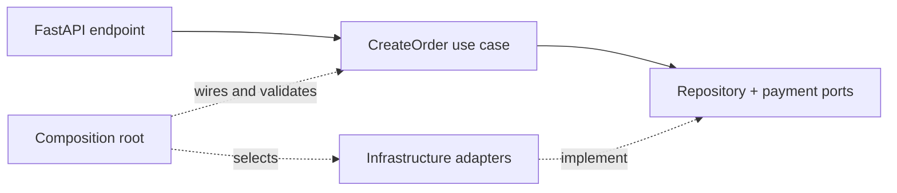

# FastAPI Clean Architecture example

The repository includes a [runnable order API](https://github.com/peter-daly/clean_ioc/tree/main/examples/fastapi_clean_architecture) that demonstrates where Clean IoC belongs in a layered application.



## Boundaries

The example is split by responsibility:

| File | Owns | Framework imports? |
| --- | --- | --- |
| `domain.py` | Order data | No |
| `application.py` | Ports, use case, audit decorator | No |
| `infrastructure.py` | Repository, payment, and audit adapters | No |
| `main.py` | FastAPI routes and Clean IoC registrations | Yes—this is the boundary |

The core use case receives typed ports through its constructor:

```python
class CreateOrder:
    def __init__(self, repository: OrderRepository, payments: PaymentGateway):
        self.repository = repository
        self.payments = payments
```

No application class performs a container lookup.

## Composition root

```python
container.register(OrderRepository, InMemoryOrderRepository, lifespan=Lifespan.scoped)
container.register(PaymentGateway, FakePaymentGateway, lifespan=Lifespan.singleton)
container.register(AuditSink, LoggingAuditSink, lifespan=Lifespan.singleton)
container.register(CreateOrder)
container.register_decorator(CreateOrder, AuditedCreateOrder, decorated_arg="wrapped")

container.validate(CreateOrder)
```

This is the only place that chooses concrete adapters and ownership. Startup validation proves that the use case and its decorator are complete before FastAPI accepts traffic.

## Request boundary

```python
@app.post("/orders")
async def create_order(
    request: CreateOrderRequest,
    handler: CreateOrder = Resolve(CreateOrder),
):
    return await handler(CreateOrderCommand(**request.model_dump()))
```

`Resolve(CreateOrder)` asks the current request scope for the application entry point. The repository is created once for that request; singleton adapters live until application shutdown.

## Run it

```bash
uv run fastapi dev examples/fastapi_clean_architecture/main.py
```

The example includes an end-to-end `TestClient` test and is exercised by the repository test suite.
