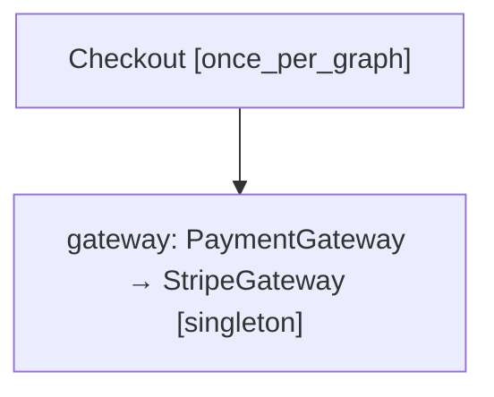

# Validate and explain dependency graphs

Dependency-injection failures often hide in entry points that were never exercised during startup. Clean IoC can statically inspect registrations so a broken graph fails in CI or application startup instead of on the first production request.

## Validate one or more entry points

```python
from clean_ioc import Container

container = Container()
container.register(Repository, SqlRepository)
container.register(CreateOrder)

container.validate(CreateOrder)
```

Pass every application entry point you want to prove:

```python
container.validate(
    CreateOrder,
    CancelOrder,
    HandlePaymentReceived,
)
```

With no arguments, `validate()` checks every registration visible to the current scope:

```python
report = container.validate()
print(report)  # Container is valid (12 roots checked).
```

Validation is static. Constructors, factories, decorators, pre-configurations, and custom value providers are never called.

## Problems detected

### Missing registration

```text
[missing-registration] No registration can supply AuditSink
(CreateOrder -> AuditSink)
```

### Circular dependency

```text
[circular-dependency] Circular dependency detected:
OrderService -> OrderRepository -> OrderService
```

Runtime resolution raises `CircularDependencyError` with the same readable cycle instead of eventually raising `RecursionError`.

### Captive scoped dependency

```text
[captive-dependency] Singleton OrderService cannot depend on scoped UnitOfWork
(OrderService -> UnitOfWork)
```

A singleton retains everything in its dependency graph. Capturing a request- or job-scoped object would keep that object alive beyond its owner, so Clean IoC rejects the graph both statically and during resolution.

### Async-only graph used synchronously

The default assumes the entry point may call `resolve_async()`. For a command, script, or other sync-only boundary, opt into the stricter check:

```python
container.validate(Command, allow_async=False)
```

This reports async factories, async generators, async decorators, and async pre-configurations that require `resolve_async()`.

## Handle validation failures

`validate()` returns a `ValidationReport` on success and raises `ContainerValidationError` when any problem is found:

```python
from clean_ioc import ContainerValidationError

try:
    container.validate(CreateOrder, CancelOrder)
except ContainerValidationError as error:
    for issue in error.issues:
        print(issue.code, issue.message, issue.path)
    raise
```

The exception includes every issue from every requested root, making it suitable for CI output.

## Explain a graph

`explain()` returns the static plan whether or not it is valid:

```python
plan = container.explain(CreateOrder)

print(plan.is_valid)
print(plan.to_text())
```

```text
CreateOrder [once_per_graph]
   └─ repository: OrderRepository -> SqlOrderRepository [scoped]
   └─ gateway: PaymentGateway -> StripeGateway [singleton, name="stripe"]
   └─ wrapped: CreateOrder -> TracedCreateOrder [once_per_graph, decorator]
      └─ clock: Clock [singleton]
```

The plan includes:

- the selected implementation, registration name, and lifespan;
- constructor and factory argument names;
- collection elements;
- values supplied by defaults or value providers;
- decorators and their injected dependencies;
- pre-configuration hooks;
- missing and cyclic branches.

## Render Mermaid

```python
print(plan.to_mermaid())
```

Paste the output into a Markdown file that supports Mermaid, or generate architecture documentation during CI:



## Use it at the composition root

A practical production pattern is:

1. create the root container;
2. register infrastructure and application services;
3. validate the public entry points;
4. enter the container lifecycle;
5. let the framework, worker, or CLI resolve those roots.

This keeps validation close to registration and prevents service-locator calls from spreading into application code.

## Static boundaries

Custom `DependencySettings.value_factory` callbacks are treated as supplied-value boundaries because calling them could have side effects or depend on runtime context. Clean IoC verifies the rest of the graph without executing the provider. Runtime-only behavior inside arbitrary user callables cannot be proven statically and should be covered by focused tests.
