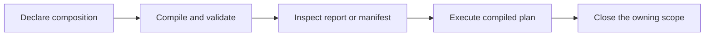

# Design rationale

Clean IoC is intended for composition roots where dependency selection, ownership, and validation are difficult to
maintain with direct construction alone. Direct construction remains preferable for small, stable object graphs.

## Applicability

The compiled container model is relevant when several of the following conditions apply:

- domain and application code must remain independent of FastAPI, a worker framework, or a CLI;
- implementations differ by environment, tenant, consuming service, name, or tag;
- database sessions, clients, and units of work have different ownership boundaries;
- handler or event-consumer families use closed generic types;
- logging, metrics, retries, or authorization should wrap services consistently;
- async factories and cleanup need to compose with synchronous application objects;
- dependency graphs need to be inspected or validated without activating application code.

Container configuration remains at the application boundary. Application and domain classes continue to use ordinary
constructors.

## Alternatives

| Approach | Strength | Trade-off |
| --- | --- | --- |
| Manual wiring | Explicit call graph and no container dependency | Ownership and variant selection remain application code |
| Service dictionary / locator | Minimal infrastructure | Dependencies become runtime lookups and are not visible in constructor signatures |
| Framework-native injection | Integrated with the framework request model | Application services may depend on framework-specific concepts |
| Clean IoC | Compiled component plans with explicit ownership | Requires a separate composition root and build step |

Clean IoC does not replace transport or framework services. With FastAPI, request parsing and transport-level
dependencies remain FastAPI concerns. Clean IoC constructs application services within the request scope.

## Manual composition

Manual construction is explicit and requires no additional abstraction:

```python
service = Checkout(SqlOrderRepository(session), StripeGateway(client))
```

As the graph grows, the composition root may also need to coordinate request sessions, client pools, tenant-specific
implementations, handler collections, decorators, and cleanup. Clean IoC represents these rules as component metadata
and compiles them before activation. It is intended to manage composition policy, not to reduce the number of constructor
calls in source code.

## Type-driven composition

Python type annotations describe constructor and factory dependencies. Clean IoC uses those annotations without
requiring application classes to inherit from library types or carry injection decorators.

Responsibility is divided as follows:

- the application owns interfaces and behavior;
- infrastructure owns implementations;
- the composition root owns selection and lifetime;
- Clean IoC compiles component plans and manages activation and cleanup.

## Composition lifecycle



The builder validates all visible roots and produces immutable activation plans. The runtime container executes those
plans and maintains only lifespan caches and cleanup state. Registration discovery and graph construction do not occur
during resolution.

## When direct composition is preferable

Prefer direct construction when:

- the graph is small and stable;
- every dependency shares the same obvious lifetime;
- there is one implementation of each abstraction;
- runtime selection, generic discovery, and decorators are unnecessary;
- adding registration would obscure rather than clarify the program.

The composition root should remain easier to inspect than the equivalent direct construction code. If it does not,
reduce the registration model or use direct construction.
